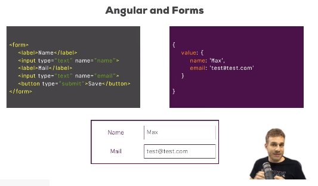
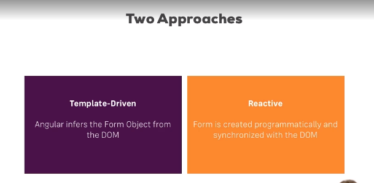

## What are Forms/Introduction

Need to handle Forms through Angular, instead of submitting to a server. Check if a form is valid, change how form is displayed, put red borders with inactive forms and such.

So how does Angular handle forms?

## Why do we need Angular's help?

EXAMPLE FORM

    <form>
    <label>Name</label>
    <input type="text" name="name">
    <label>Mail</label>
    <input type="text" name="email">
    <button type="submit">Save</button>
    </form>

Would be helpful if some metadata was stored if valid, and not stored if it's not valid.

Gives JS form of your form to see state of form and work with it?

## Template-Driven (TD) vs Reactive Approach

## An Example Form

## TD: Creating the Form and Registering the Controls

Ah! We once again see ngModel, as we did with 2-way data binding. But with 2-way, [{ngModel}] was like this. Now we will revisit this, but for now, it's without wrapping.

Enough to tell A, hey this is actually a control of my form!

*select* is much like *input*

## TD: Submitting and Using the Form

## TD: Understanding Form State

## TD: Accessing the Form with @ViewChild

## TD: Adding Validation to check User Input

## Built-In Validators & Using HTML5 Validation

## TD: Using the Form State

## TD: Outputting Validation Error Messages

## TD: Set Default Values with ngModel Property Binding

## TD: Using ngModel with Two-Way-Binding

## TD: Grouping Form Controls

## TD: Handling Radio Buttons

## TD: Setting and Patching Form Values

## TD: Using Form Data

## TD: Resetting Forms

## Assignment: Template-driven Forms (Problem)

## Assignment: Template-driven Forms (Solution)

==============